# Care360 - Gestión y Cuidado Familiar 🏥

**Care360** es una solución integral diseñada para facilitar el seguimiento de la salud y el bienestar de personas mayores o dependientes. La aplicación permite coordinar el cuidado entre varios miembros de la familia en tiempo real, centralizando la información médica y de actividad diaria en un solo lugar.

---

## 📸 Capturas de Pantalla
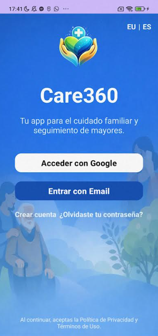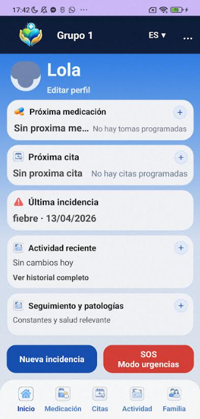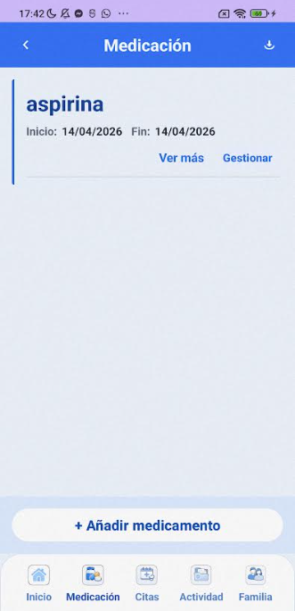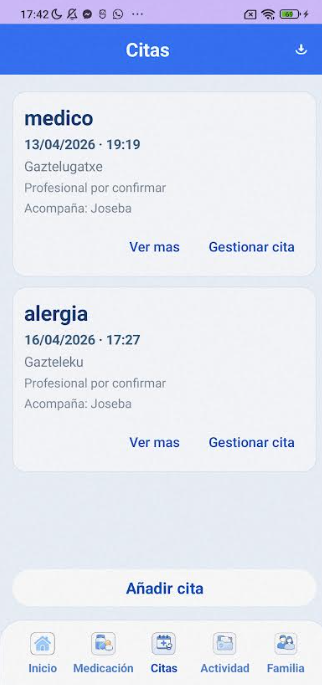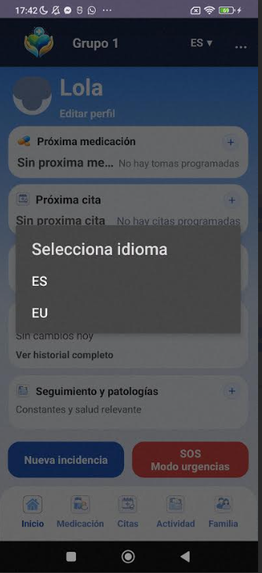
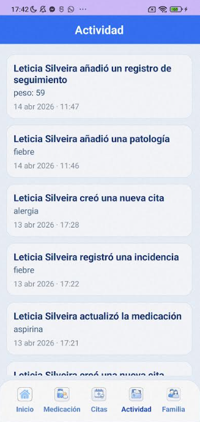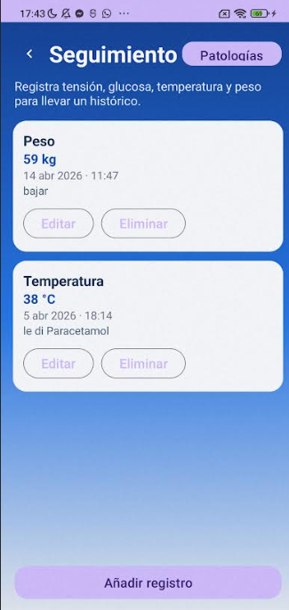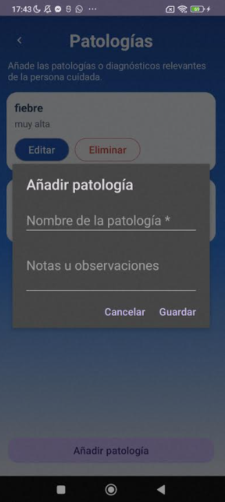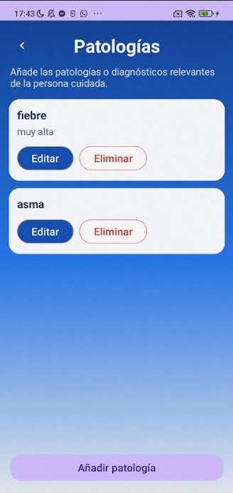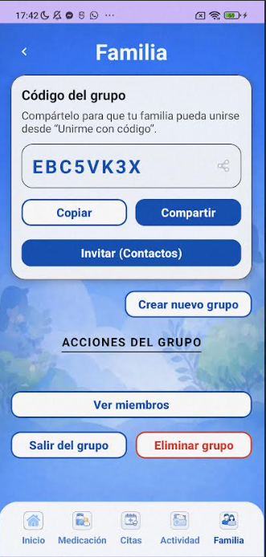
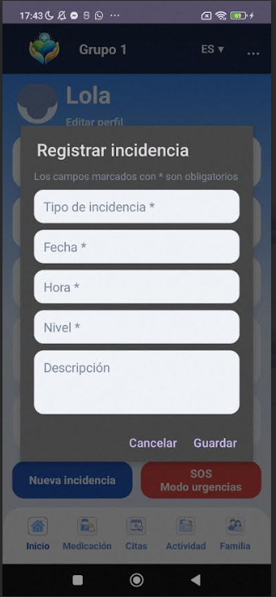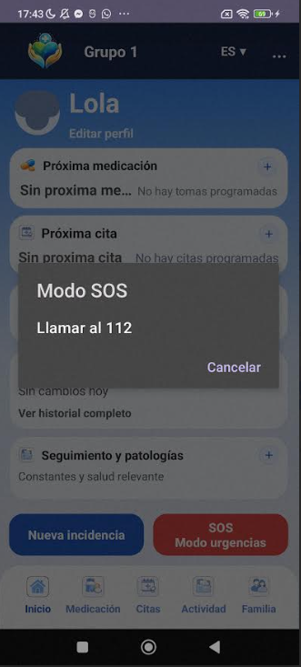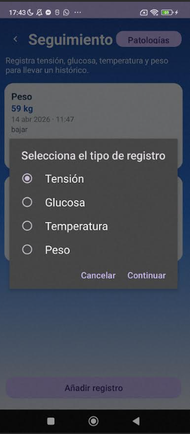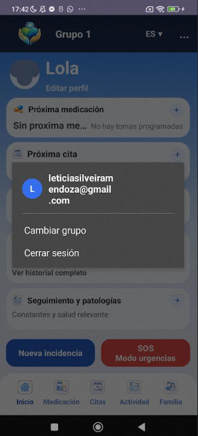
---

## ✨ Características Principales

- **Gestión de Medicación:** Seguimiento detallado de tratamientos, horarios de toma y recordatorios configurables.
- **Calendario de Citas:** Registro de citas médicas, lugares y profesionales encargados del acompañamiento.
- **Seguimiento de Salud:** Monitorización de constantes vitales como tensión arterial, glucosa, temperatura y peso.
- **Gestión de Patologías:** Historial de diagnósticos y observaciones relevantes para el cuidado.
- **Grupos Familiares:** Sistema de grupos mediante código de invitación para compartir la información con otros cuidadores en tiempo real.
- **Historial de Actividad:** Registro cronológico de todas las acciones realizadas por los miembros del grupo (quién añadió una medicina, cita, etc.).
- **Modo SOS:** Acceso rápido a servicios de emergencia (112) y contactos de emergencia configurados.
- **Exportación de Informes:** Generación de archivos PDF detallados de medicación e incidencias para facilitar la comunicación con médicos.

---

## 🛠️ Stack Tecnológico

- **Lenguaje:** Java (Android SDK)
- **Arquitectura:** Clean Architecture con patrón MVVM (Model-View-ViewModel).
- **Backend:** Firebase (Firestore y Auth)
- **UI:** XML layouts
- **Librerías :**
  - ViewModel 
  - Firebase
  - Google Play Services (Auth)

---

## 🏗️ Arquitectura del Proyecto

El proyecto sigue los principios de **Arquitectura Limpia**, dividiéndose en tres capas principales:

1. **Capa de Datos (`data`):** Implementación de repositorios, fuentes de datos (Firebase/Room) y mappers.
2. **Capa de Dominio (`domain`):** Modelos de negocio y lógica pura independiente de la tecnología.
3. **Capa de Interfaz (`ui`):** ViewModels y vistas (Activities/Fragments) que gestionan la interacción con el usuario.

---

## 🚀 Instalación y Uso

1. **Clonar el repositorio:**
   ```bash
   git clone https://github.com/LeticiaMendoza75/Care360.git
   ```
2. **Configuración de Firebase:**
   Este repositorio no incluye el archivo `google-services.json` por motivos de seguridad.
   - Crear un proyecto en la [Consola de Firebase](https://console.firebase.google.com/).
   - Añadir una app de Android con el nombre de paquete `com.silveira.care360`.
   - Descargar el archivo `google-services.json` y colocarlo en la carpeta `app/`.
   - Habilitar Google Sign-In y Email/Password en Authentication.
3. **Compilar y Ejecutar:**
   - Abrir el proyecto en Android Studio.
   - Sincronizar con Gradle y ejecutar en un dispositivo o emulador.


## ✉️ Contacto

Leticia Silveira - [LinkedIn](https://www.linkedin.com/in/leticia-silveira-mendoza-396395309) - leticiasilveiramendoza@gmail.com

¡Gracias por revisar mi proyecto! 🚀
